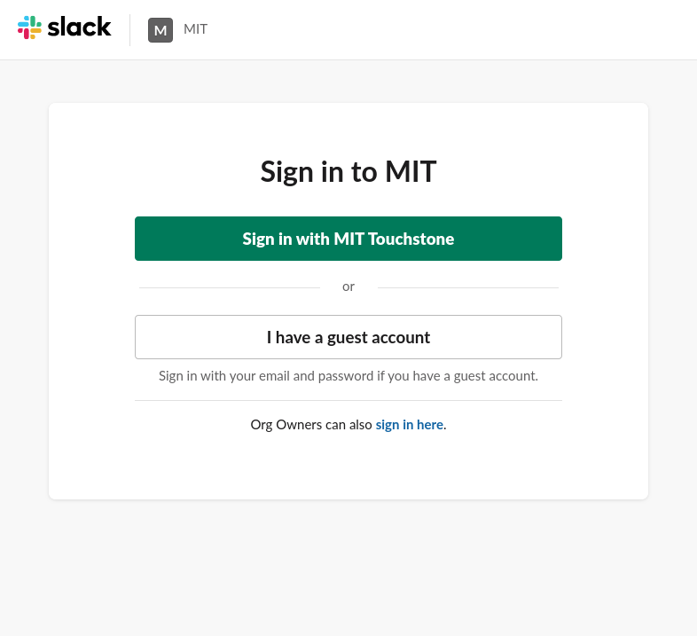
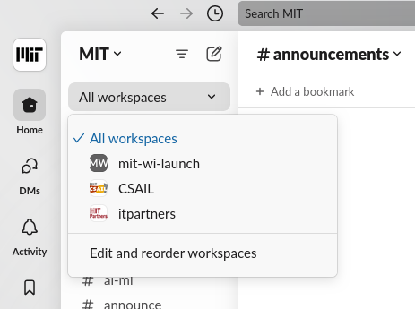
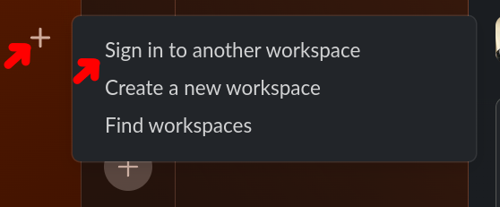
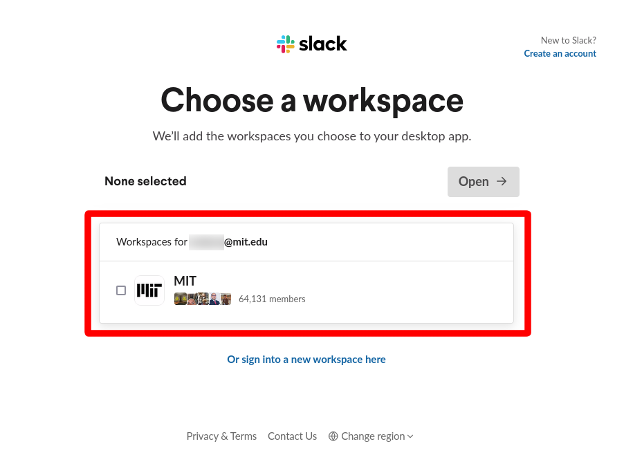

# Click the link!

<h2><a href="https://mit-wi-launch.slack.com">https://mit-wi-launch.slack.com</a></h2>

# Log In
When you first click the link you'll be asked to sign in with you Touchtone credentials.

After that it should redirect offer for you to download the slack app or open it if it is already installed.

# See the MIT slack workspace

When you're in the slack app it will appear that you're in a general MIT slack, and you are. The WI Launch slack is a workspace within that larger Slack Enterprise-Grid.

By default, all the channels from all the mit workspaces you belong to will be displayed all together. You can use the dropdown to filter the channel list to just a specific workspace.

# Add the the MIT workspaces to the Slack desktop app

After you log in via the browser the first time then adding it to the app should be easy. Click a the plus in the sidebar, then "Sign in to another workspace"

Then you should already have the MIT slack listed in your list. After that the channel list filtering is the same as in the browser.

