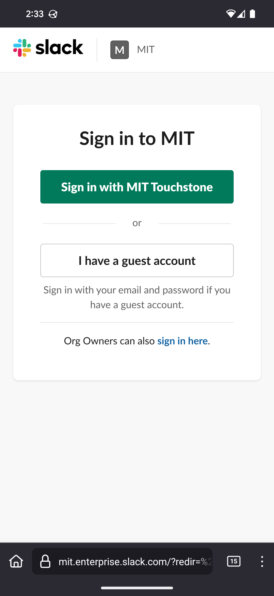
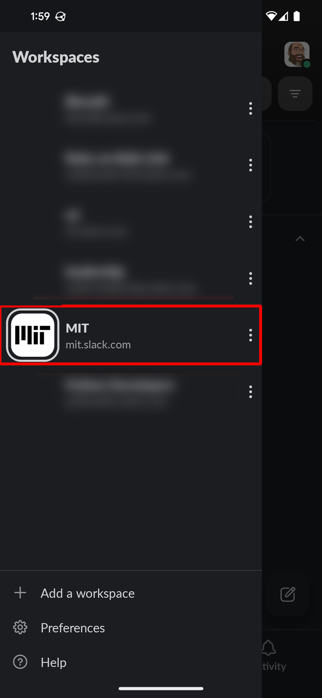
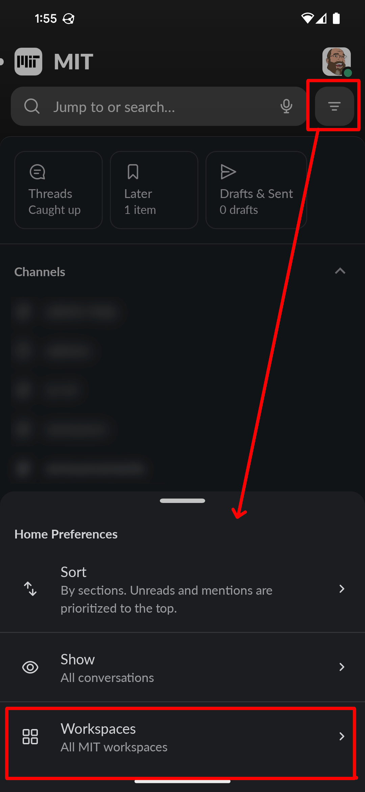
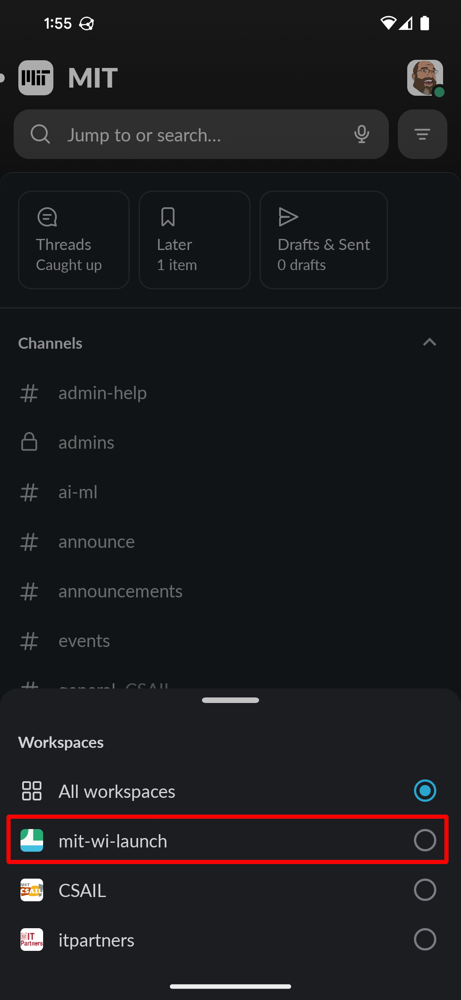

--
layout: page
---

# Click the link!

<h2><a href="https://mit-wi-launch.slack.com">https://mit-wi-launch.slack.com</a></h2>

# Log In
When you first click the link you'll be asked to sign in with you Touchtone credentials.

After that it should redirect offer for you to download the slack app or open it if it is already installed.

# See the MIT slack workspace

When you're in the slack app it will appear that you're in a general MIT slack, and you are. The WI Launch slack is a workspace within that larger Slack Enterprise-Grid.

By default, all the channels from all the mit workspaces you belong to will be displayed all together.

# Filter to just mit-wi-launch channels

You can filter the list of channels just to one workspace.

Then pick the channels you want to see.

